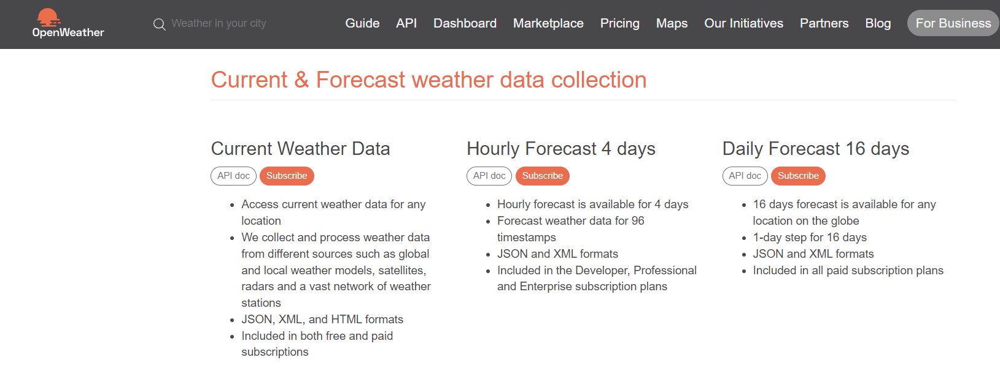

# Examen Parcial - CC312

## Pregunta 1: OpenWeather

Para este apartado, haremos uso de la API de OpenWeather. Para ello, primero nos crearemos una cuenta en openweather.org; seguidamente, nos dirigiremos al apartado de API y nos succribiremos en Current Weather Data.

Confirmares nuestro correo electrónico y ya se nos habrá generado nuestra API key personal.

Una vez realizado esto, ya podremos pasar a resolver los Jupyter Notebooks.

Para nuestro caso, importaremos las librerías requests y json. Y tomaremos nuestra ciudad como input. Trabajamos con el código de estado y el tipo de contenido. Finalmente, del requests.get conseguiremos nuestro archivo JSON e imprimiremos la temperatura de la ciudad de la que hayamos ingresado.

## Pregunta 2: NumbersAPI

Para este apartado, haremos uso de la API NumbersAPI que nos dá datos interesantes de algún número, de no haber un dato interesante en esta API, se le llamará un número aburrido.

De igual manera, importaremos las librerías requests y json. Seguidamente, leeremos un archivo de números test_numbers.txt, y con la ayuda requests.get, guardaremos nuestros datos ern formato JSON. Guardamos los resultados en un arreglo, y el output lo escribiremos en el archivo test_numbers_result.txt. 

